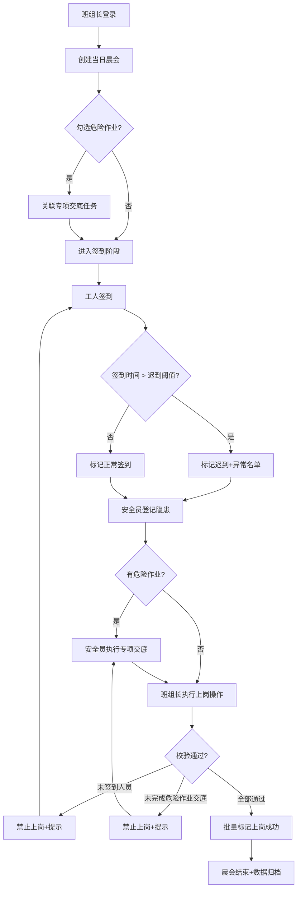

## 1. 产品概述

工地安全晨会看板是面向建筑施工场景的数字化安全管理工具，帮助班组长、安全员和工人实现晨会签到、上岗管控、隐患排查和安全交底的全流程闭环管理，确保施工安全规范落地执行。

- 目标用户：班组长、安全员、现场工人
- 核心价值：管住签到上岗、管住危险作业、管住异常行为
- 场景定位：每日晨会时段，工地现场集中使用

## 2. 核心功能

### 2.1 用户角色

| 角色 | 使用方式 | 核心权限 |
|------|----------|----------|
| 班组长 | 晨会组织者 | 创建晨会、管理班组、查看上岗状态 |
| 安全员 | 安全监督者 | 记录隐患、进行专项交底、查看异常名单 |
| 工人 | 晨会参与者 | 个人签到、查看上岗状态、完成专项交底确认 |

### 2.2 功能模块

1. **晨会看板主页**：晨会概览卡、统计面板、快速操作区、异常名单
2. **晨会创建页**：选择班组、设置晨会时间、添加作业内容
3. **签到模块**：工人签到、迟到判定、异常名单醒目标识
4. **上岗管控模块**：签到关联上岗、未签到禁用上岗、危险作业校验
5. **隐患记录模块**：隐患登记、照片描述、整改跟踪
6. **专项交底模块**：危险作业勾选、交底内容记录、签字确认
7. **班组管理页**：班组增删改查、工人档案维护

### 2.3 页面详情

| 页面名称 | 模块名称 | 功能描述 |
|----------|----------|----------|
| 晨会看板主页 | 晨会状态卡 | 显示当日晨会状态：未创建/进行中/已结束，快速创建或进入 |
| 晨会看板主页 | 统计面板 | 应到人数、实到人数、迟到人数、未签到人数、隐患数、上岗率 |
| 晨会看板主页 | 签到列表 | 工人签到状态表：姓名、工种、签到时间、状态（正常/迟到/未到）、上岗状态 |
| 晨会看板主页 | 异常名单区 | 迟到/未签到工人独立列表，红色醒目边框+闪烁标识展示 |
| 晨会看板主页 | 上岗操作区 | 批量上岗按钮，校验未签到人员禁止上岗，危险作业校验专项交底 |
| 晨会看板主页 | 快速操作 | 创建晨会、签到入口、隐患登记、专项交底入口按钮 |
| 晨会创建页 | 基本信息 | 日期、班组选择、晨会标题、作业内容 |
| 晨会创建页 | 危险作业勾选 | 高处作业/动火作业/有限空间/起重吊装等多选项勾选 |
| 签到弹窗 | 签到表单 | 选择工人、自动记录签到时间、系统判定是否迟到 |
| 隐患登记页 | 隐患信息 | 隐患标题、类型、等级、位置、描述、整改人、整改期限 |
| 专项交底页 | 交底内容 | 对应危险作业类型的交底内容模板、交底人、交底时间 |
| 专项交底页 | 签字确认 | 参与工人勾选确认、已交底状态标记 |
| 班组管理页 | 班组列表 | 班组信息增删改查、工人名单维护 |
| 班组管理页 | 工人档案 | 工人姓名、工种、身份证号、联系方式、照片 |

## 3. 核心流程

### 3.1 晨会主流程

班组长每日到达工地后，先创建当日晨会（选择班组、勾选危险作业类型）→ 工人到场后依次签到，系统自动记录时间并判定迟到 → 安全员在晨会过程中登记隐患并进行专项交底（危险作业必须完成）→ 晨会结束前班组长执行上岗操作，系统自动校验：未签到人员禁止上岗、有危险作业的必须已完成专项交底 → 通过校验后批量标记上岗 → 迟到人员自动进入异常名单红色醒目展示。

### 3.2 流程图

## 4. 用户界面设计

### 4.1 设计风格

- **主色调**：安全警示黄（#F59E0B）+ 工业深蓝（#1E3A5F），辅助色：警戒红（#DC2626）、安全绿（#16A34A）
- **整体基调**：工业风、高对比度、信息密度高，强调醒目和清晰
- **按钮风格**：方形略圆角、实心色块、hover阴影加深
- **字体**：标题使用思源黑体 Bold，正文使用思源黑体 Regular，数字使用等宽字体
- **布局风格**：顶栏导航 + 主体卡片网格，关键信息卡片边框加粗
- **图标风格**：线性 lucide 图标，异常/警戒状态切换为实心图标

### 4.2 页面设计概述

| 页面名称 | 模块名称 | UI 元素特点 |
|----------|----------|-------------|
| 晨会看板主页 | 统计面板 | 4个大数字卡片横排，每个带渐变背景和图标，实时刷新动效 |
| 晨会看板主页 | 异常名单区 | 红色渐变边框、黄色闪烁背景、工人头像+姓名+迟到分钟数 |
| 晨会看板主页 | 签到列表 | 斑马纹表格，状态列彩色徽章，行hover高亮 |
| 晨会看板主页 | 上岗操作区 | 巨型黄色主按钮，点击后弹出校验进度对话框 |
| 晨会创建页 | 危险作业勾选 | 卡片式多选，选中后卡片边框高亮+对勾角标 |
| 专项交底页 | 签字确认区 | 工人头像网格，已确认显示绿色对勾印章效果 |
| 班组管理页 | 工人档案 | 卡片式布局，头像+基本信息+工种标签 |

### 4.3 响应式设计

- Desktop 优先（1280px+），适配工地大屏看板展示
- 平板端（768-1279px）：统计面板改为2×2网格，签到列表保持全宽
- 移动端（<768px）：签到列表换行展示，操作按钮底部悬浮固定
- 触控优化：所有可点击元素最小 44px，列表项整行可点击

### 4.4 视觉细节与动效

- 异常名单卡片呼吸闪烁动画（透明度 0.85↔1，每 1.5s 循环）
- 签到成功弹窗：绿色对勾放大旋转动画
- 上岗校验：进度条逐项绿色✓，未通过项红色✗
- 数字滚动：统计面板数字从 0 滚动到目标值
- 表格行入场：stagger 渐入，每行延迟 50ms
- 页面切换：淡入+轻微上移（20px 内）
