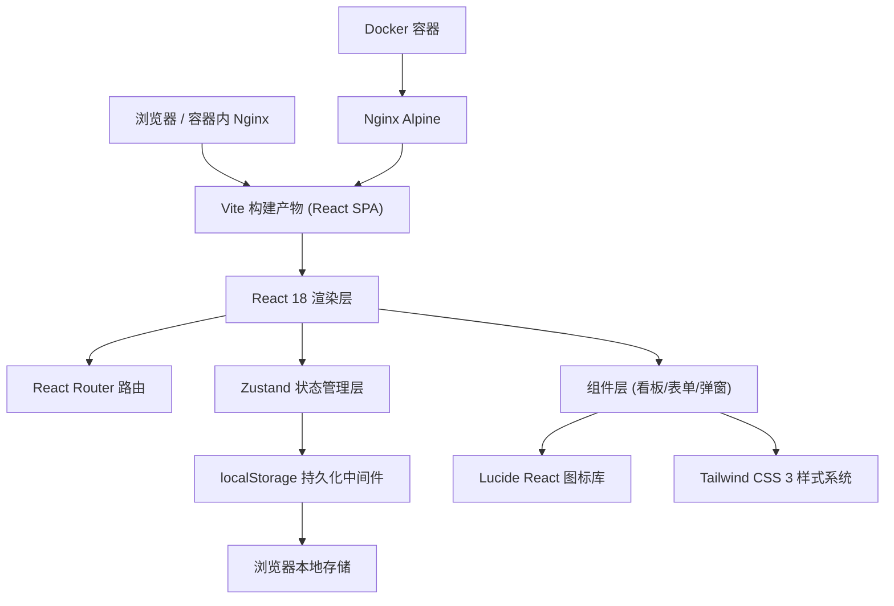
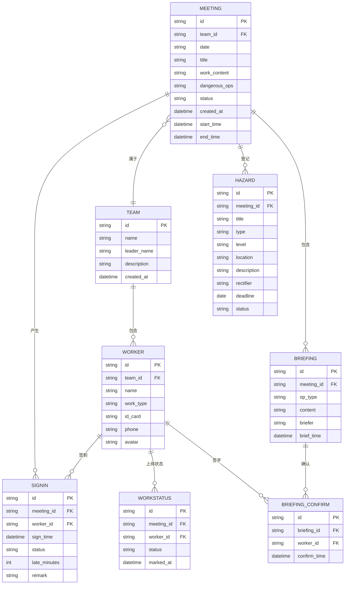

## 1. 架构设计



## 2. 技术选型说明

- **前端框架**：React@18 + TypeScript
- **构建工具**：Vite@5（热更新快、构建产物小）
- **样式方案**：Tailwind CSS@3 + CSS 变量（设计 Token 系统）
- **状态管理**：Zustand@4（轻量、内置 persist 中间件适配 localStorage）
- **路由**：React Router DOM@6
- **图标**：lucide-react
- **本地数据**：浏览器 localStorage（zustand-persist 自动序列化）
- **容器化**：多阶段 Dockerfile，构建阶段用 node:18-alpine，运行阶段用 nginx:alpine

## 3. 路由定义

| 路由路径 | 页面名称 | 主要功能 |
|----------|----------|----------|
| `/` | 晨会看板主页 | 晨会状态总览、统计面板、签到列表、异常名单、上岗操作 |
| `/meeting/create` | 创建晨会 | 新建当日晨会、选择班组、勾选危险作业 |
| `/meeting/signin` | 签到页面 | 工人签到、迟到判定 |
| `/hazard` | 隐患登记 | 隐患列表、新增隐患、整改跟踪 |
| `/briefing` | 专项交底 | 交底列表、新建交底、签字确认 |
| `/team` | 班组管理 | 班组CRUD、工人档案维护 |

## 4. 数据模型

### 4.1 ER 图



### 4.2 localStorage 存储键设计

| 存储键 | 数据类型 | 初始值 | 说明 |
|--------|----------|--------|------|
| `site-board:teams` | Team[] | 预置 2 个班组 | 班组档案 |
| `site-board:workers` | Worker[] | 预置 10 个工人 | 工人档案 |
| `site-board:meetings` | Meeting[] | [] | 晨会记录 |
| `site-board:signins` | SignIn[] | [] | 签到记录 |
| `site-board:hazards` | Hazard[] | [] | 隐患记录 |
| `site-board:briefings` | Briefing[] | [] | 交底记录 |
| `site-board:briefingConfirms` | BriefingConfirm[] | [] | 交底签字确认 |
| `site-board:workStatuses` | WorkStatus[] | [] | 上岗状态 |
| `site-board:settings` | Settings | { lateThreshold: 10 } | 系统配置（迟到阈值分钟数） |

## 5. Zustand Store 模块划分

| Store 名 | 主要 state | 主要 actions |
|----------|------------|--------------|
| `useTeamStore` | teams, workers | addTeam, updateTeam, deleteTeam, addWorker, updateWorker, deleteWorker |
| `useMeetingStore` | meetings, currentMeetingId | createMeeting, updateMeeting, endMeeting, getTodayMeeting |
| `useSignInStore` | signIns | createSignIn, getSignInByMeeting, getAbnormalList |
| `useHazardStore` | hazards | addHazard, updateHazard, deleteHazard, updateHazardStatus |
| `useBriefingStore` | briefings, briefingConfirms | addBriefing, confirmBriefing, isDangerousOpsCompleted |
| `useWorkStatusStore` | workStatuses | markOnDuty, validateAndMarkOnDuty, isOnDuty |

## 6. 业务规则校验逻辑

### 6.1 上岗校验函数 `validateAndMarkOnDuty(meetingId)`

```
输入：晨会ID
流程：
  1. 获取该晨会全部工人清单
  2. 获取该晨会签到记录
  3. 筛选未签到工人 → 若有 → 返回错误：未签到人员名单
  4. 获取晨会勾选的危险作业列表
  5. 若危险作业非空：检查对应专项交底记录是否存在且签字齐全
     - 缺少交底 → 返回错误：需完成的交底类型
     - 签字不全 → 返回错误：未确认工人名单
  6. 全部通过 → 批量写入 WORKSTATUS，状态=已上岗
返回：{ success: boolean, errors: string[] }
```

### 6.2 迟到判定逻辑 `isLate(signTime, meetingStartTime)`

```
输入：签到时间, 晨会开始时间
读取 settings.lateThreshold（默认 10 分钟）
返回：signTime > meetingStartTime + 阈值 时标记迟到
late_minutes = 实际相差分钟数（仅迟到时记录）
```

## 7. 目录结构

```
src/
├── components/
│   ├── dashboard/
│   │   ├── StatCard.tsx
│   │   ├── AbnormalList.tsx
│   │   ├── SignInTable.tsx
│   │   └── OnDutyPanel.tsx
│   ├── meeting/
│   │   ├── MeetingForm.tsx
│   │   ├── DangerousOpsCard.tsx
│   │   └── SignInModal.tsx
│   ├── hazard/
│   │   ├── HazardForm.tsx
│   │   └── HazardList.tsx
│   ├── briefing/
│   │   ├── BriefingForm.tsx
│   │   └── ConfirmGrid.tsx
│   ├── team/
│   │   ├── TeamCard.tsx
│   │   └── WorkerForm.tsx
│   └── common/
│       ├── AppHeader.tsx
│       ├── StatusBadge.tsx
│       ├── EmptyState.tsx
│       └── PageTransition.tsx
├── pages/
│   ├── Dashboard.tsx
│   ├── CreateMeeting.tsx
│   ├── SignIn.tsx
│   ├── Hazard.tsx
│   ├── Briefing.tsx
│   └── TeamManage.tsx
├── stores/
│   ├── team.ts
│   ├── meeting.ts
│   ├── signIn.ts
│   ├── hazard.ts
│   ├── briefing.ts
│   ├── workStatus.ts
│   └── settings.ts
├── types/
│   └── index.ts
├── utils/
│   ├── date.ts
│   ├── storage.ts
│   ├── validator.ts
│   └── mockData.ts
├── hooks/
│   └── useAnimatedNumber.ts
├── App.tsx
├── main.tsx
└── index.css
```

## 8. Dockerfile 设计（多阶段构建）

- **阶段 1 (build)**：node:18-alpine，WORKDIR /app，COPY package*.json → pnpm/npm install → COPY 源码 → npm run build
- **阶段 2 (runtime)**：nginx:alpine，COPY 构建产物到 /usr/share/nginx/html，COPY 自定义 nginx.conf 支持 SPA history 路由，EXPOSE 80

## 9. 预置 Mock 数据

- 2 个班组：土建一班、机电安装班
- 10 名工人，覆盖工种：钢筋工、木工、电工、焊工、架子工
- 系统设置：迟到阈值 10 分钟
